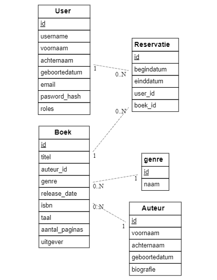

# Arno Collier (202186939)

- [ ] Web Services:
  - https://github.com/Web-IV/2324-webservices-ArnoCollier.git
  - <LINK_ONLINE_VERSIE_HIER>

**Logingegevens**

- Gebruikersnaam/e-mailadres: ArnoCollier
- Wachtwoord:'$argon2id$v=19$m=131072,t=6,p=1$9AMcua9h7va8aUQSEgH/TA$TUFuJ6VPngyGThMBVo3ONOZ5xYfee9J1eNMcA5bSpq4'

## Projectbeschrijving

## API calls

### Users

- `GET /api/users`: alle gebruikers ophalen
- `GET /api/users/:id`: gebruiker met een bepaald id ophalen

### Boek

- `GET /api/boeken`: alle boeken ophalen
- `GET /api/boeken/:id`: boeken met een bepaald id ophalen

## Auteurs

- `GET /api/auteurs`: alle auteurs ophalen
- `GET /api/auteurs/:id`: auteurs met een bepaald id ophalen

## Reservatie

- `GET /api/reservaties`: alle reservaties ophalen
- `GET /api/reservaties/:id`: reservaties met een bepaald id ophalen

## Behaalde minimumvereisten
### Web Services

- **datalaag**

  - [X] voldoende complex (meer dan één tabel, 2 een-op-veel of veel-op-veel relaties)
  - [X] één module beheert de connectie + connectie wordt gesloten bij sluiten server
  - [X] heeft migraties - indien van toepassing
 

- **repositorylaag**

  - [x] definieert één repository per entiteit (niet voor tussentabellen) - indien van toepassing
  - [x] mapt OO-rijke data naar relationele tabellen en vice versa - indien van toepassing
 

- **servicelaag met een zekere complexiteit**

  - [x] bevat alle domeinlogica
  - [x] bevat geen SQL-queries of databank-gerelateerde code
 

- **REST-laag**

  - [x] meerdere routes met invoervalidatie
  - [x] degelijke foutboodschappen
  - [x] volgt de conventies van een RESTful API
  - [x] bevat geen domeinlogica
  - [x] geen API calls voor entiteiten die geen zin hebben zonder hun ouder (bvb tussentabellen)
  - [x] degelijke authorisatie/authenticatie op alle routes
 

- **algemeen**

  - [x] er is een minimum aan logging voorzien
  - [ ] een aantal niet-triviale integratietesten (min. 1 controller >=80% coverage)
  - [ ] minstens één extra technologie
  - [x] maakt gebruik van de laatste ES-features (async/await, object destructuring, spread operator...)
  - [ ] duidelijke en volledige README.md
  - [ ] volledig en tijdig ingediend dossier en voldoende commits

## Projectstructuur

### Web Services

Door verschillende mappen te gebruiken zoals in de voorbeeld applicatie

## Extra technologie

### Web Services

Ik wou als extra technologie de rest API in typescript maken. Ik heb dit geprobeerd en heb hier enorm veel tijd aan verspild. Het is niet gelukt om het te doen werken. Dus ben ik terug gegaan naar dit project in javascript. Ik heb dus geen extra technologie. Ik heb mijn typescript bestand ook gecommit maar dit werkt dus niet...

## Testresultaten

### Web Services
Mijn testen gingen niet goed. Ik vond het heel moeilijk om dit te maken.

